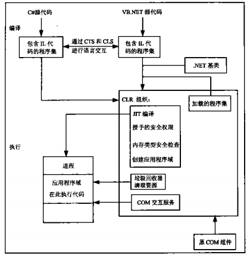

# 第一章 .NET 体系结构

### 目录
* [1.1 C#与.NET的关系](#11-cnet)
* [1.2 公共语言运行库(CLR)](#12-clr)
* [1.2.1--1.2.3 三大特性](#121-123)
* [1.3.1 面性对象和接口的支持](#131)
* [1.3.3 强数据类型化](#113)
* [1.3.4 通过异常处理错误](#134)
* [1.4 程序集](#14)
* [1.4.3 反射](#143)
* [1.5 .net framework库](#15-net-framework)
* [1.6 命名空间](#16)
* [1.9 小结](#19)
* [2.0 C#语言编写代码流程](#20-c)

### 1.1 C#与.NET的关系

先来一波定义:
> `Microsoft .NET Framework`是用于Windows的新托管代码编程模型。它将强大的功能与新技术结合起来，用于构建具有视觉上引人注目的用户体验的应用程序，实现跨技术边界的无缝通信，并且能支持各种业务流程。-- 百度百科 
> `C#`是微软公司发布的一种面向对象的、运行于.NET Framework之上的高级程序设计语言。而且它是微软公司 .NET windows网络框架的主角。 
> `C#`是面向对象的编程语言。 
> `C#`使得C++程序员可以高效的开发程序，且因可调用由 `C/C++`  编写的本机原生函数，因此绝不损失C/C++原有的强大的功能。-- 节选自 百度百科
> `C#`本身仅仅是一种语言, 并不是.NET的一部分. .net支持的一些特性c#并不支持, c#支持的一些特性, .net不支持(eg. 运算符重载) -- C#高级编程 

个人理解:
2017-09-09
> C#与.NET的关系 目前就像是 Java和JRE的关系, 左边是语言, 右边是运行的环境. 也就是说我们C# 的程序要跑在 .NET的环境里. 第一天学习, 凭感觉的理解,有待更新. 

### 1.2 公共语言运行库(CLR)
.net framework的核心其运行库的执行环境, 称为CLR或者.net运行库.
CLR执行源代码之前要编译, 编译顺序: 
1> 源代码-->Microsoft 中间语言(IL) 
2> CLR把 IL-->平台`专用`目标代码. 

### 1.2.1--1.2.3 三大特性
1> `平台无关性`, 由于中间代码(IL)的存在, CLR可以编译成任意环境的专用代码. 这点个人觉得非常类似 java的平台无关性, 但是java 只要有java虚拟机 那就ok喽. 
2> `提高性能`, 跟IL相关, IL采用及时性编译(JIT编译), 就是说程序源代码并不是一开始就全部编译完成, 程序运行多少编译多少, 直到本次运行结束为止. 也就是说, 没用的代码, JIT编译从来不会编译它. 
3> `语言的互操作性`, 任何一种语言都可以编译成IL中间语言. 

### 1.3.1 面性对象和接口的支持
面向对象语言的三大特性: 分装,继承,多态. 
C#是单继承, 所以,IL引入了接口的特性, 解决了多继承的问题. 

### 1.3.3 强数据类型化
C#和java, C等一样, 整数就要用int, 浮点数就要用float.  每一种"东西"都有自己的类型, 猫是猫,狗是狗, 并不能, 猫是"东西",狗是"东西",一切都是"东西"(不是很恰当, 意思到位就好). 
并不能像javascript一样, var 存任何数据.(弱数据类型)

### 1.3.4 通过异常处理错误
和java类似,C# 支持Exception,并且 finally块. 
eg: 当出现1/0, 0不能做除数的情况时候, 需要用到异常处理, 来处理这种数学错误. 

### 1.4 程序集
程序集 是一个逻辑单元, 并不是物理单元. 
目前理解: 若干文件 + 一个类似目录功能的主文件= 程序集 

### 1.4.3 反射
A程序员编写一段代码codeA 并且封装好了 
B程序员通过编程, 访问codeA里面的各种属性和方法, 这就是反射. 

### 1.5 .net framework库
是一个丰富的, 托管代码类的集合. 非常强大的代码库. 

### 1.6 命名空间
区域A 有一个人叫tom 
区域B 也有一个人叫tom 
当程序需找tom时, 并不知道是哪个tom 
A.tom和B.tom这种组合就叫做命名空间(类似java的包(package)) 

### 1.9 小结
* COM component（COM组件）是微软公司为了计算机工业的软件生产更加符合人类的行为方式开发的一种新的软件开发技术。在COM构架下，人们可以开发出各种各样的功能专一的组件，然后将它们按照需要组合起来，构成复杂的应用系统。由此带来的好处是多方面的：可以将系统中的组件用新的替换掉，以便随时进行系统的升级和定制；可以在多个应用系统中重复利用同一个组件；可以方便的将应用系统扩展到网络环境下；COM与语言，平台无关的特性使所有的程序员均可充分发挥自己的才智与专长编写组件模块。-- 百度百科
* 垃圾回收, C#和Java 带有垃圾回收机制,并不像C/C++需要手动回收资源, 程序员不需要分散过多的注意力在资源回收的方面.

### 2.0 C#语言编写代码流程
