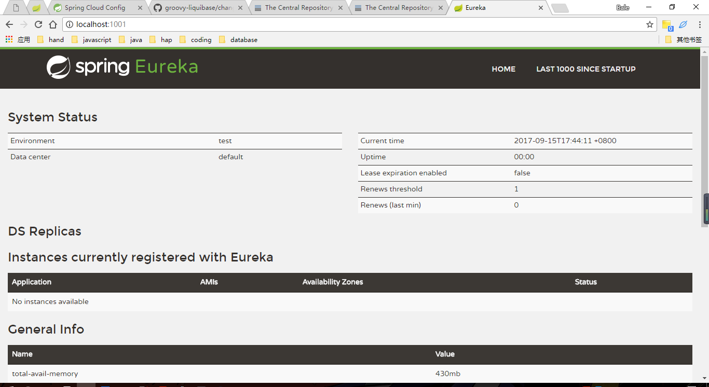

# Spring cloud 开始 eureka注册中心

[Spring cloud 官网](http://projects.spring.io/spring-cloud/)

### eureka注册中心

> eureka 注册中心, 作用就像是餐馆的菜单, 菜单不提供任何"菜"(服务), 但是可以通过菜单点菜.

直接开始配置:
```
//创建一个spring-boot项目
//编写pom文件
```
```pom
    <dependencies>
        ...
        <!--eureka server-->
        <dependency>
            <groupId>org.springframework.cloud</groupId>
            <artifactId>spring-cloud-starter-eureka-server</artifactId>
        </dependency>
    </dependencies>

    <!--cloud-dependecies-->
    <dependencyManagement>
        <dependencies>
            <dependency>
                <groupId>org.springframework.cloud</groupId>
                <artifactId>spring-cloud-dependencies</artifactId>
                <version>Dalston.SR2</version>
                <type>pom</type>
                <scope>import</scope>
            </dependency>
        </dependencies>
    </dependencyManagement>

    <build>
        <plugins>
            <plugin>
                <groupId>org.springframework.boot</groupId>
                <artifactId>spring-boot-maven-plugin</artifactId>
            </plugin>
        </plugins>
    </build>
```
编写application.properties配置文件:
```
#服务名称
spring.application.name=eureka-service
#端口号
server.port=1001

#禁止自己注册到注册中心
eureka.instance.hostname=localhost
eureka.client.fetch-registry=false
eureka.client.register-with-eureka=false

#注册中心地址
eureka.client.service-url.defaultZone=http://localhost:${server.port}/eureka/
```

编写主类方法:
```EurekaServerApplication
@SpringBootApplication
//其实就是添加一个注释
@EnableEurekaServer
public class EurekaServerApplication {

    public static void main(String[] args) {
        SpringApplication.run(EurekaServerApplication.class, args);
    }
}
```

```
//ok 运行一波
访问 http://localhost:1001/看一下结果
```


### 注意事项
这里注意pom文件的书写原因, 引入eureka-server时候并没有写version<br>
[原因在这dependencyManagement和dependencies区别](#)
第二个就是,为什么maven不引入eureka而是引入eureka-server<br>
这查看源码之前我以为是包含关系, 但是通过查看之后:
* eureka 是 eureka-client
* eureka-server 是真的 eureka-server
[eureka pom](http://search.maven.org/#artifactdetails%7Corg.springframework.cloud%7Cspring-cloud-starter-eureka%7C1.3.4.RELEASE%7Cjar)
```
        ...
        <dependency>
            <groupId>org.springframework.cloud</groupId>
            <artifactId>spring-cloud-netflix-eureka-client</artifactId>
        </dependency>
        ...
```
[eureka server pom](http://search.maven.org/#artifactdetails%7Corg.springframework.cloud%7Cspring-cloud-starter-eureka-server%7C1.3.4.RELEASE%7Cjar)
```
        ...
        <dependency>
            <groupId>org.springframework.cloud</groupId>
            <artifactId>spring-cloud-netflix-eureka-server</artifactId>
        </dependency>
        ...
```